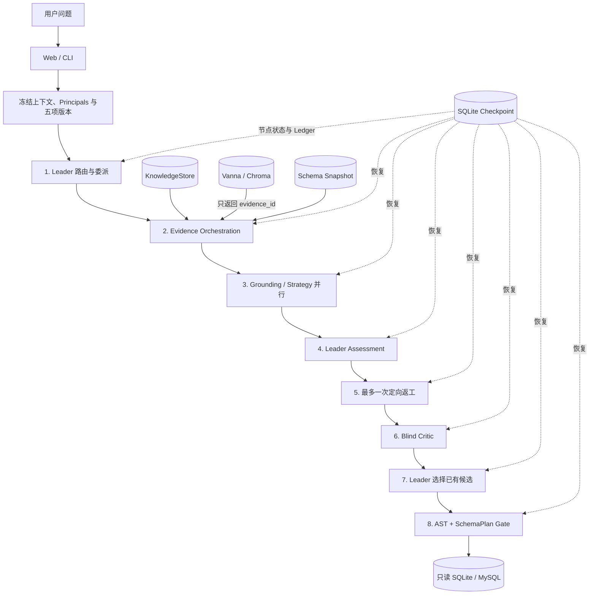

# EvoSQL

> 可进化多智能体 Text2SQL 系统：用角色化推理提高可解释性，用确定性代码守住证据、权限、恢复和执行边界。

EvoSQL 将自然语言问题转换为可审计、可拒绝、可恢复的只读 SQL。它不是把整个数据库 Schema 塞进一次 Prompt，而是把一次查询拆成 8 个运行节点，由 Leader、Schema Grounding、SQL Strategy 和 Blind Critic 分工，再通过 Hybrid RAG、SchemaPlan、AST/EXPLAIN、安全白名单和只读数据库连接完成最终执行。

当前仓库定位为**具备真实模型全量 baseline 的工程原型**，不是已经完成线上自进化的生产系统。项目保留了旧 EvoAgent PR Review 子系统；`evoagent` Python 包名和 `EVOAGENT_*` 环境变量作为兼容接口暂不修改。

## 为什么需要 EvoSQL

单 Agent 一次性生成 SQL，容易把多个问题混在同一条推理链里：

- Schema 幻觉：引用不存在或含义相近但错误的表列；
- 业务口径错误：语法正确，却把“案例数”算成明细行数；
- Join fanout：连接后重复计数，或者使用未经审核的关联关系；
- 自我确认偏差：同一个模型既生成又批准自己的 SQL；
- 执行风险：Prompt 中的“只读要求”不能构成真正的权限边界；
- 长链路重跑：进程中断后重复调用模型、重复计费或串用旧状态。

EvoSQL 的核心原则是：

> 模型负责提出候选，确定性 Harness 负责验证证据、限制能力并决定是否执行。

## 系统架构



外层是固定的 8 节点状态机；真正的并发发生在 `text2sql-workers` 节点内部，两名 Worker 由线程池并行运行。四个名称是 Runtime Role 与可演化 Policy 槽位，不是四个独立服务或四份 Codex `SKILL.md`。

## 核心设计

### 1. Leader–Workers–Critic 编排

| 角色 | 主要职责 | 输出边界 |
|---|---|---|
| `text2sql-lead` | 路由、委派、冲突检查、有限返工和最终选择 | 最终只能选择已有候选，不能临时创造新 SQL |
| `schema-grounding` | 绑定表、列、值、结果粒度与有证据的 Join | 生成机器可检查的 `SchemaPlan` |
| `sql-strategy` | 推导过滤、聚合、去重、排序和候选 SQL | 生成 `QuerySpec` 与最多 4 个 `SQLCandidate` |
| `text2sql-critic` | 对去来源化候选做反例审查 | 只能接受、拒绝和提出异议，不能新增候选 |

Grounding 与 Strategy 当前共享 Harness 预取的同一份 EvidencePack，但使用隔离上下文和不同输出契约。因此它实现的是**职责隔离**，不是统计意义上的完全独立。

### 2. Hybrid RAG 与 Schema Linking

```text
MySQL Dump
  → Database Snapshot / Join Candidates
  → KnowledgeStore：stable / candidate / quarantined / revoked
  → 词法、精确值、已审核关系图 + Vanna 语义召回
  → stable / snapshot / ACL 回源重验
  → EvidencePack
  → LLM 草案 SQL（永不执行）
  → SQLGlot AST 反向提取表列
  → DraftLinkPack（不可信候选）
  → Grounding 校验
  → SchemaPlan（SQL 表列白名单）
```

Vanna 在项目中被裁剪为纯检索器：`ask`、`generate_sql` 和 `run_sql` 均不可用。向量结果只提供候选 evidence ID，必须回到 KnowledgeStore 重新检查知识状态、数据库快照和调用者 ACL。所谓 Draft Planner 仍由项目 LLM 生成草案，Vanna 本身不生成或执行 SQL。

### 3. 模型外 SQL 安全壳

候选 SQL 即使得到所有模型角色同意，也必须通过以下确定性门禁：

1. SQLGlot 解析为单条只读 Query；
2. 拒绝 DDL、DML、危险节点和禁止函数；
3. 表、列必须存在于固定 Database Snapshot；
4. SQL 使用范围必须是 `SchemaPlan` 的子集；
5. 候选原样通过 `EXPLAIN`；
6. SQLite 使用 `mode=ro&immutable=1` 与 `PRAGMA query_only=ON`；
7. 执行器限制超时和最大返回行数。

### 4. 持久化 Checkpoint

每个运行节点成功后都会把增量 State 和累计 ExecutionLedger 写入独立 SQLite Store。恢复时只接受从第一个节点开始的连续完成前缀，并继续第一个未完成节点。

Checkpoint 身份绑定：

- Question 与冻结会话上下文；
- user / session / tenant 与 effective principals；
- Database、Wiki、Vanna、Memory、Policy 五项版本；
- LLM provider、model 和 temperature；
- 节点图、协议、Token/时间/步骤预算；
- stable / candidate lane。

Store 还使用 Lease 防止同一任务并发执行，使用 canonical JSON 与 SHA-256 检测篡改；任务完成后，相同身份的重复请求直接返回持久化结果。

### 5. 受控 Memory / Policy 演化

```text
train 或治理后的生产失败
  → candidate Memory
  → 人工审核
  → stable Memory
  → Root-cause 聚类与角色归因
  → 单角色 Policy Candidate
  → validation + sealed holdout
  → Shadow 差异审核
  → Canary + stable fallback
  → 人工激活或回滚
```

候选 Policy 只能修改受限 Prompt Guidance、字段/值别名、安全 Few-shot、工具子集和有界预算；不能修改拓扑、安全门、数据库权限、评测数据或审批状态。

## 当前证据

以下数字来自仓库内固定工件，时间为 2026-09-04：

| 维度 | 当前结果 | 证据 |
|---|---:|---|
| 数据库 | 20 张表、562 行 | `artifacts/text2sql/schema/database_snapshot.json` |
| 稳定知识 | 395 条：293 Schema + 102 Value | `artifacts/text2sql/knowledge/manifest.json` |
| 候选知识 | 101 条：97 Relationship + 4 Business Glossary | 同上，审核前不进入稳定检索 |
| Vanna 索引 | 395 项：20 DDL + 375 Documentation + 0 Question-SQL | `artifacts/text2sql/vanna/stable-v2-2b44cc2f83/manifest.json` |
| 评测集 | 240 题，按 SQL Skeleton 切分为 144 / 48 / 48 | `evaluation/datasets/text2sql_eval_v1.json` |
| 全量 baseline | EX 93.75%，Executable 97.08%，Read-only Safety 100% | `qwen3.7-flash`，240 题 |
| 延迟与用量 | P50 38.89s，P95 54.05s，1,881 次 LLM 调用，12,506,995 Tokens | 固定全量评测工件 |
| 失败 | 13 个语义/安全失败 + 2 个 Framework Error | 不隐藏失败项 |
| Text2SQL 测试 | 79 / 79 通过 | `tests/test_text2sql*.py` |
| 全仓库测试 | 148 / 148 通过 | 包含保留的 Legacy PR Review 子系统 |
| 演化状态 | 1 个 baseline Policy，0 Memory，0 candidate deployment | 演化机制已实现，真实候选闭环尚未完成 |

完整报告见 [`full-240-qwen3.7-flash-draftlink-20260904.json`](artifacts/text2sql/evaluation/full-240-qwen3.7-flash-draftlink-20260904.json)。

## 快速体验

### 环境要求

- Python 3.11
- SQLite 3
- 一个 OpenAI Chat Completions 兼容模型端点；Vanna/Chroma 为可选语义检索层

### 1. 安装

```bash
git clone <repository-url>
cd EvoSQL

python3.11 -m venv .venv
source .venv/bin/activate
python -m pip install -r requirements.txt
cp .env.example .env
```

`.env` 已被 Git 忽略。不要提交 API Key、审核签名密钥或生产数据库凭据。

### 2. 无 API 成本验证完整协议

脚本化模型可以验证四角色协议、真实只读执行与最终结果，无需调用云模型：

```bash
python -m unittest \
  tests.test_text2sql_phase2.Text2SQLSafetyTests.test_original_hierarchical_protocol_runs_before_deterministic_execution \
  -v
```

该测试对问题“强烈岩爆案例有多少个”断言最终结果为 `[[6]]`，并检查 Grounding、Strategy 与 6 次脚本化模型调用确实发生。

### 3. 重建本地工件

```bash
python scripts/generate_text2sql_schema.py
python scripts/build_text2sql_sqlite.py --replace
python scripts/build_text2sql_knowledge.py
python scripts/build_text2sql_vanna.py
python scripts/bootstrap_text2sql_evolution.py
```

### 4. 配置模型

编辑 `.env`。以自定义 OpenAI-compatible 端点为例：

```dotenv
EVOAGENT_LLM_PROVIDER=custom
EVOAGENT_LLM_BASE_URL=https://your-provider.example/v1
EVOAGENT_LLM_API_KEY=your-api-key
EVOAGENT_LLM_MODEL=your-model
```

也可以使用 `.env.example` 中的 DashScope、DeepSeek 或 OpenRouter 配置。Text2SQL 主链路不会在 `local` provider 下模拟真实 LLM。

### 5. 运行单题

```bash
python scripts/run_text2sql.py \
  "强烈岩爆案例有多少个" \
  --task-id demo-rockburst-001
```

中断后使用相同问题和 `task-id` 重试，系统会从持久化节点继续；如果问题、身份、版本或预算发生变化，则拒绝复用旧状态。

### 6. 启动 Web 控制台

```bash
python -m evoagent
```

浏览器打开 `http://127.0.0.1:8080/`。本地默认关闭登录；对外暴露服务前必须启用认证并更换所有示例凭据。

### 7. 运行 Text2SQL 测试

```bash
python -m unittest discover -s tests -p 'test_text2sql*.py' -v
```

## 目录结构

| 路径 | 作用 |
|---|---|
| `evoagent/text2sql/agentic.py` | 8 节点 Multi-Agent 主链路 |
| `evoagent/runtime.py` | 通用节点 Runtime、预算与 Checkpoint 协议 |
| `evoagent/text2sql/checkpoint_store.py` | SQLite 节点状态、Lease、Hash 与完成结果缓存 |
| `evoagent/text2sql/knowledge_store.py` | 版本化知识、ACL、状态机和结构化检索 |
| `evoagent/text2sql/vanna_retriever.py` | Retriever-only Vanna/Chroma 适配层 |
| `evoagent/text2sql/schema_linking.py` | 问题直连、Draft AST 与 DraftLinkPack |
| `evoagent/text2sql/sql_safety.py` | AST、Schema、EXPLAIN 与只读执行门禁 |
| `evoagent/text2sql/evaluation.py` | Execution Accuracy、结果规范化与失败归因 |
| `evoagent/text2sql/evolution.py` | Memory、Policy、评测 Gate 与审批账本 |
| `evoagent/text2sql/shadow.py` | Shadow、Canary、Fallback 与回滚状态机 |
| `web/` | EvoSQL Web 控制台 |
| `tests/test_text2sql*.py` | Text2SQL 专项单元与集成测试 |

## 深入阅读

- [项目导学](导学-EvoSQL.md)
- [Text2SQL 设计与适配方案](Text2SQL自进化适配方案.md)
- [Multi-Agent 基线](docs/text2sql/PHASE2_AGENTIC_BASELINE.md)
- [Checkpoint 运行手册](docs/text2sql/CHECKPOINT_RUNBOOK.md)
- [Vanna 与 Memory 边界](docs/text2sql/VANNA_MEMORY_RUNBOOK.md)
- [评测协议](docs/text2sql/PHASE3_EVALUATION.md)
- [受控自进化](docs/text2sql/PHASE4_SELF_EVOLUTION.md)
- [Shadow / Canary](docs/text2sql/PHASE5_SHADOW_RELEASE.md)

## 已知限制

- 当前全量评测题普遍显式包含物理表名或字段名，因此 93.75% EX 不能证明自然业务问法上的 RAG 泛化能力；
- 当前 stable 知识只有 Schema 与观测值，97 条推断关系和 4 条 Wiki 术语仍处于 candidate；
- 当前 Vanna 索引没有经人工批准的 Question-SQL 样例；
- Grounding 与 Strategy 共享 Grounding 视图检索结果，Strategy 自己的检索权重在主路径尚未单独生效；
- Lead 的静态 ACL 仍包含只读执行工具，阶段级 delegation / assessment / selection 零工具约束尚待收紧；
- Checkpoint 已固定 Vanna 版本，但离线晋升 Gate 与 Shadow 漂移检查尚未完整显式比较 `vanna_index_version`；
- 当前演化库没有 stable failure Memory、候选 Policy 或真实 deployment，尚未完成一次有净提升证据的端到端演化实验；
- 本地 SQLite 是当前 MVP 执行后端，远程数据库的事务、资源隔离和生产压测仍需补充。

## Roadmap

- 清零现有 Framework Error，并按失败类型复盘 13 个未通过案例；
- 建立不暴露物理标识符的自然语言 relevance set，分别评测 Retrieval Recall、Context Precision 与 Schema Linking；
- 审核高价值 Join/Wiki 候选，构建首批稳定业务口径与 Question-SQL；
- 为 Leader 增加阶段级 Tool ACL，并补齐 Vanna 版本的 promotion/shadow 负向测试；
- 从 train failure 完成首个“Memory → 单角色 Policy → validation/holdout → Shadow/Canary”闭环；
- 增加 CI、远程数据库故障注入、浏览器并发与端到端可观测性证据。

## 数据与开源说明

仓库中的数据库 dump、Wiki 示例和评测工件仅用于当前项目的本地研究与演示。公开发布前请再次确认原始数据、第三方内容和模型输出的授权范围。仓库当前未附带开源许可证，未经许可不代表可以自由再分发。
