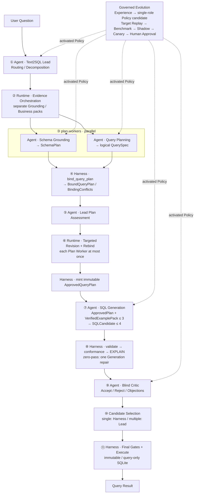

# EvoSQL

> Plan-first、可审计、可恢复的 Multi-Agent Text2SQL 系统。模型负责理解与提出候选，确定性 Harness 负责绑定、验真、限权和决定是否执行。

EvoSQL 把“一次 Prompt 直接生成 SQL”拆成五个职责隔离的 Agent 和一个不可演化的确定性 Harness：Schema Grounding 负责物理世界，Query Planning 负责逻辑语义，SQL Generation 只翻译已经冻结的计划，Blind Critic 独立质疑候选，Lead 只做路由、审批与选择。失败经验不会在线改 Prompt；它先成为有前后差异证据的 Experience，再编译成单 Agent Policy Candidate。默认发布链经过定向回放、离线评测、Shadow、Canary 和人工批准；本地 MVP 另提供只接纳机器可验证证据、通过完整回放与独立评测后自动激活的受限模式。

当前仓库定位为工程原型，不宣称已经完成生产部署。项目现在只包含 Text2SQL 应用；Python 包名 `evoagent` 与 `EVOAGENT_*` 环境变量保持不变。

## 系统架构



当前主链协议为 `plan-first-text2sql-v3`，固定 11 个可恢复 Runtime Node。第 3 个 `plan-workers` 节点内部并行执行 Schema Grounding 与 Query Planning；第 6 个节点在两种计划都需要修订时也可并行。Agent Role、Runtime Node 和 Codex `SKILL.md` 是不同概念；五个名称表示运行时角色与 Policy 槽位，不是五个独立服务。

当前构建为 v18。第 2 节点包含两个非 Agent、单次受限模型组件：正向 Schema Linker 与 Vanna 草稿生成器；完整、无修订且路由无额外工具调用的单候选路径通常使用 8 次模型调用。第 10 节点在只有一个候选通过机器校验和 Critic 时，由 Harness 直接选择；多个候选通过时仍由 Lead 选择。路由、计划角色与计划审批可返回 `needs_clarification`，本轮不会生成可执行候选或执行 SQL，用户补充后以新任务重新查询。接口、失败归因与验证说明见 [框架层修改说明](docs/FRAMEWORK_CHANGES.md)。

## Agent 职责、输入与工具

| 执行主体 | 核心输入 | 结构化输出 | 当前推理回合工具 |
|---|---|---|---|
| `text2sql-lead` | 原始问题、受限会话上下文、Worker / Critic 结果 | Route、Delegation、Plan Approval、Final Candidate Index | 路由阶段可使用受控事实工具；审批与最终选择为零工具 |
| `schema-grounding` | 固定 Schema Snapshot、`GroundingPack/v1` 与 deterministic schema-link 候选 | `SchemaPlan`：表、列、值绑定、Join、结果粒度 | Evidence Orchestration 预取后，本轮零工具 |
| `query-planning` | 用户问题、来自业务 Markdown 的 `PlanningBusinessPack/v1` | 不含物理表列与 SQL 的 `QuerySpec` | 零工具，最大 Tool ACL 也是空集 |
| `sql-generation` | 不可变 `ApprovedQueryPlan`；可选 `VerifiedExamplePack/v1`（最多 3 条） | 最多 4 个 `SQLCandidate` | 由 Harness 在本节点检索并组包；Agent 本轮零工具，不能自行检索或执行 |
| `text2sql-critic` | ApprovedQueryPlan、通过门禁且去来源化的候选、对应 Gate 结果 | 每个候选恰好一个 Accept / Reject 决定 | 零工具，不能新增或修改 SQL |
| `text2sql-harness`（非 Agent） | 两类 Plan、候选 SQL、固定版本 Pin | Bound / Approved Plan、Gate 结果、查询结果 | `validate_sql`、`explain_sql`、最终 `execute_sql` |

角色最大权限与阶段权限取交集。`text2sql-lead` 和 `schema-grounding` 的最大 ACL 只包含事实查询能力；Planning、Generation、Critic 的最大 ACL 为空；只有 Harness 拥有 `execute_sql`，且只会在第 11 节点的最终门禁通过后调用。

## 为什么采用 Plan-first

单 Agent 同时做 Schema Linking、业务口径、SQL 生成和自我验收，常见问题包括：

- 引用不存在或语义相近但错误的表列；
- 把“案例数”算成 Join 后的明细行数；
- 未经审核地猜测 Join，产生 fanout 或笛卡尔积；
- SQL 语法正确，但投影、去重、排序、NULL 或结果粒度不符合问题；
- 模型既生成又批准自己的候选；
- Prompt 中的“请只读”被误当成数据库权限边界。

EvoSQL 先让两个独立 Worker 产出逻辑计划和物理计划，再由无模型 Binder 做完整、唯一绑定。SQL Generation 不接收原始问题或计划前证据：它以 ApprovedQueryPlan 为唯一语义约束，只能额外参考最多 3 条与当前计划同表同列、已复验的 Question-SQL 结构示例，因此计划偏移可以在执行前被机器检查。

## RAG 与 Schema Linking

```text
Schema Snapshot ────────→ Vanna DDL / Schema Documentation ─┐
Business Markdown ──────→ Vanna Documentation ──────────────┼─→ role-scoped retrieval
Confirmed Question-SQL ─→ Vanna Question-SQL ───────────────┘
Join Catalog ───────────→ deterministic Schema Grounding（独立，不以 Vanna 为权威）

Node 2 Evidence Orchestration
  ├─ 正向：一次 LLM Schema Linking + 确定性关键词匹配
  ├─ Vanna：DDL + Documentation + Confirmed Question-SQL → 不执行的草稿 SQL
  ├─ 反向：草稿 AST → 表/字段/Join → Snapshot 同名字段所属表扩展
  ├─ 有缺口时：补充 Vanna 检索 → GroundingPack/v1 + SchemaLinkPack/v3
  │                                               → Schema Grounding
  ├─ PlanningBusinessPack/v1（仅业务语义）           → Query Planning
  └─ ApprovedQueryPlan 后召回 Question-SQL
       → SQL/plan scope 复验
       → VerifiedExamplePack/v1（最多 3 条）          → SQL Generation
```

这是一个单用户项目，不设置独立 KnowledgeBase，也不为业务文档维护 Candidate / Stable / ACL 审批层。`knowledge/business` 中的 Markdown 默认可信，构建时直接写入 Vanna Documentation；Schema Snapshot 直接构建 DDL 与字段说明；用户确认且通过 SQL Gate 的 Question-SQL 直接进入 Vanna Question-SQL。Vanna 是这三类内容的 RAG 检索索引，不是编辑真源，也不负责审核。

Vanna backend 仍是纯检索器：`ask`、`generate_sql`、`submit_prompt` 和 `run_sql` 被封锁，也没有数据库连接。第 2 节点的请求级草稿生成器只消费一次冻结的 Vanna 检索结果与正向链接，产出永不执行、仅供 AST 反向提取的候选 SQL；它不是 Agent，也不能再次检索或连接数据库。Query Planning 仍只接收业务语义，DDL、物理标识符、实库值、Join、草稿 SQL 和 Question-SQL 都会被过滤；Schema Grounding 接收 Snapshot 校验后的链接、完整相关 DDL 和物理证据，Question-SQL 正文只进入隔离的草稿生成上下文。ApprovedQueryPlan 铸造后，Harness 仍会独立召回 Question-SQL，并将通过 SQL 安全和当前计划表列范围复验的最多 3 条样例组成 `VerifiedExamplePack/v1`。

## 确定性安全边界

模型一致同意也不等于可以执行。当前 Harness 会：

1. 对 QuerySpec 与 SchemaPlan 做严格类型、形状、唯一绑定和 fingerprint 校验；
2. 将物理表列绑定回当前 Schema Snapshot，拒绝索引版本漂移或越界标识符；
3. 要求 Join 来自独立 Join Catalog 的可用条目；`user_explicit` Join 必须由原始问题的精确 qualified-column 等式解析，不能由 Lead 改写或模型声明授权；
4. 对 `eq` / `in` 值检查只读实库成员关系；范围和 LIKE 检查类型、映射与可信表面来源；
5. 用 SQLGlot 拒绝 DDL、DML、多语句、注释逃逸、未知表列、`SELECT *` 和未建模查询形状；
6. 对投影顺序、聚合、`DISTINCT`、过滤、Join、排序、NULL 顺序、LIMIT、EXISTS 等做 ApprovedQueryPlan conformance；
7. 将候选与 Gate 结果按 Harness 生成的 `candidate_id` 对齐后再交给 Critic；
8. 在最终节点重新执行 AST 与 plan-conformance 检查；
9. 通过 `mode=ro&immutable=1`、`PRAGMA query_only=ON`、wall-clock timeout 和最大行数限制执行 SQLite。

追问中的 Lead `standalone_question` 只是推理输入，不是事实来源。新值必须来自本轮原始用户问题，或来自同一 session 下、最终 Gate 已接受的父 QueryRun 的结构化 QuerySpec；显式 Join 同理继承自可信父 SchemaPlan。FOLLOW_UP 缺少完整认证父快照时会停止，不能继续使用 Lead 改写生成 SQL，也不会静默绑定“最近一轮”。RESULT_QA 只支持明确要求重显上一轮结果的 replay：返回文案由 Harness 根据认证后的列与行确定性生成，不接受 Lead 自由编写的数字或事实；比较、过滤、排序或计算仍需发起新查询。自然语言表面匹配只能证明文本出现，不能形式化证明所有语义，因此新查询的最终语义仍由 Lead 与 Blind Critic 共同审核。

## 持久化 Checkpoint

每个节点成功后，系统把增量 State 与累计 Execution Ledger 写入 SQLite Checkpoint Store。恢复时只接受从第一个节点开始的连续已完成前缀，并继续第一个未完成节点。

Checkpoint 身份同时绑定：

- 原始问题、冻结会话上下文与 session；
- 四个逻辑版本 Pin：Database Snapshot、Vanna corpus、Memory、Policy；业务 Markdown 摘要已经参与 Vanna corpus fingerprint，不是独立 Pin；wire 兼容字段 `wiki_index_version` 当前承载的也是 Vanna corpus version；
- LLM provider、model、temperature 与 Token / 时间 / 步骤预算；
- stable / candidate Policy lane；
- 当前 Policy 已吸收的来源 Memory ID 集合（用于避免规则双重注入）；
- `plan-first-text2sql-v3`、完整 11 节点图、`BUILD_VERSION=text2sql-agentic-build-v18` 和 `GATE_IMPLEMENTATION_VERSION=text2sql-harness-gates-v10`。

Store 使用 Lease 避免同任务并发执行，使用 canonical JSON 与 SHA-256 检测状态篡改。协议、节点、Gate 实现或任一 Pin 漂移时，旧 Checkpoint 会 fail closed；完成任务在身份完全一致时可直接返回持久化结果。

## Memory 与 Knowledge 职责边界

EvoSQL 把“数据与业务事实”和“系统经历及学到的规则”分开管理：Schema Snapshot、业务 Markdown 和已确认 Question-SQL 构建 Vanna 检索索引；Memory 保存会话、查询经历与角色经验。两条链互不替代。

### 三种记忆

| 分组 | 记忆 | 保存内容与格式 | 沉淀方式 | 运行时用途 |
|---|---|---|---|---|
| 会话记忆 | Working Memory | `role + content + task_id + session_id + created_at` | 每轮自动写入；每个会话最多 100 条消息，滚动淘汰 | 为 Lead 提供最近对话上下文 |
| 会话记忆 | Episodic Memory | 一次完整 QueryRun：问题、Plan、SQL、Gate、结果、反馈、来源 lane 与版本 Pin | 每次查询结束自动形成一条；页面最多显示 50 条，MVP 不物理删除旧证据 | 追问、历史回看、根因分析与审计 |
| 长期学习记忆 | Semantic Experience | `ExperienceMemory/v1`：来源任务、owner Agent、问题、修正、适用条件、前后差异和证据 | 用户纠错、Plan 修订成功或 SQL Gate 修复产生 candidate / needs_evidence；由人工确认或严格机器证据准入变为 confirmed | 不直接注入 Agent；Confirmed Experience 只能作为 Policy Candidate 的有审计来源 |

Question-SQL 不属于 Memory。用户确认正确且 SQL 复验通过后，它直接作为 Vanna Question-SQL 检索案例保存；QueryRun 仅保留来源关联，供追溯或删除。

Working Memory 关心“刚才说了什么”；Episodic Memory 关心“什么时候、在哪条运行 lane、使用哪些版本，发生了什么”。QueryRun 只是可追溯经历，不会自动变成正确经验。Semantic Experience 保存有前后差异证据的行为修订；离线 `SemanticRule/v1` 只负责把证据归纳成同一 Agent 的候选规则，不参与 Runtime Memory 检索。Policy 才定义 Agent 怎么工作，并保存 Experience 与 SemanticRule 来源。Checkpoint 负责节点恢复，Execution Ledger 负责调用审计，它们都不属于 Memory。

```text
Query
  ├─ recent messages ───────────────→ Working Memory
  ├─ complete timelined QueryRun ───→ Episodic Memory
  └─ Human Feedback
       ├─ correct + SQL revalidation → Vanna Question-SQL Case
       └─ incorrect + evidence ──────→ Semantic Experience Candidate
```

### 三类 Vanna 输入与两类独立事实

```text
Database Snapshot ────────→ DDL / Schema Documentation ─┐
Business Markdown ────────→ Documentation ──────────────┼─→ Vanna / Chroma
Confirmed Question-SQL ───→ Question-SQL ───────────────┘

Join Catalog ─────────────→ deterministic binding
Working / Episodic Memory ─→ session context / audit
Confirmed Experience ──────→ offline Policy Candidate source
```

| 组件 | 只负责什么 | 明确不负责什么 |
|---|---|---|
| Database Snapshot | 表、列、类型、注释与观测值等物理事实 | 不解释业务指标，也不承担 Join 审批 |
| `knowledge/business` | 业务实体、术语、指标、粒度、过滤、NULL、去重与值语义 | 不保存 DDL、完整 SQL 或 Agent 行为规则 |
| Join Catalog | 跨表连接键、基数、目标粒度和 fanout 风险 | 不作为普通业务文档，也不由向量相似度决定能否连接 |
| Vanna / Chroma | 索引 DDL、Documentation 与已确认 Question-SQL，按阶段提供召回 | 不生成或执行 SQL，不管理业务知识审批状态 |
| Memory | Working、Episodic 与 Semantic Experience | Experience 不直接充当 Runtime Prompt，也不充当 Schema、业务文档或 Question-SQL 索引 |

业务 Markdown 在这个单用户项目中默认可信，不存在“候选业务知识”或“发布为 Stable”这一步。Experience 生命周期与 Policy 发布状态也不能与 Vanna 内容混为一谈。业务 Markdown 由 `business_documents.py` 解析和校验，运行时只读取固定版本的 VannaCorpus。

## Memory 自进化

“自进化”不是让 Agent 在线改自己的 Prompt。当前有人工治理链和更严格的本地自动 MVP；两者都不会在查询请求内修改 Prompt。

```text
Successful Query + User confirms correct
  → QueryRun provenance + deterministic SQL revalidation
  → Vanna Question-SQL Case（不属于 Memory）

Incorrect Feedback / deterministic repair
  → Experience candidate / needs_evidence
  → machine-verifiable evidence admission（不完整证据停止）
  → LLM SemanticRule extraction
  → same-Agent prompt_fragment-only Policy candidate
  → source QueryTrace Target Replay
  → validation + sealed_holdout（48 + 48）
  → complete identity / lineage / safety recheck
  → atomic activation（任一门禁失败则保持旧版本）
  → rollback when needed
```

正反馈与错误学习是两条不同的链：用户明确确认正确的 Question-SQL 经来源校验和确定性 SQL Gate 后，直接成为 Vanna 可检索案例；它不属于 Memory，也不会修改 Agent Policy。错误反馈及确定性修复进入 Semantic Experience，并归因到明确职责槽位。自动模式只接纳能够由代码复核的修订前后证据；纯文字反馈、证据不足和无法唯一归因的异常仍停在 `needs_evidence` 或人工治理链。LLM 只能归纳规则与提出单 Agent Prompt，不能修改拓扑、Binder、SQL Gate、数据库权限、aliases、Question-SQL、预算、评测集或审批状态。

晋升门禁不信任评测报告自带的聚合数字：它先校验 baseline / candidate 的匿名逐题 outcome 是否完整、唯一、类型合法且字段语义一致，再自行重算 EX、安全率、可执行率、AST 解析率、framework error、P95 延迟和 SQL Skeleton 分桶；任一声明值不一致、candidate 某个 split 的可执行率 / AST 解析率为零，或 sealed holdout 出现单题回退都会 fail closed。问题文本、Gold SQL 与逐题结果不会写入演化库。

## 当前可核验证据

数据与评测规模来自固定工件；清理后的验证记录见 [清理说明](docs/CLEANUP.md)。公开仓库保留 Schema/Join 元数据与评测集，不分发数据库导出、运行记忆、向量索引及逐次评测报告；下表中的运行报告路径指本地工件，并非仓库附件。

| 维度 | 当前结果 | 证据 |
|---|---:|---|
| 数据库快照 | 20 张表、562 行 | `artifacts/text2sql/schema/database_snapshot.json` |
| 业务 Markdown | 5 个业务页面，作为 Documentation 的默认可信输入 | `knowledge/business/` |
| Join Catalog | 97 条已检查：13 条启用、72 条不纳入默认连接、12 条证据不足暂不启用 | `artifacts/text2sql/schema/join_catalog.review.json` |
| Vanna 输入 | Schema Snapshot + Business Markdown + 用户确认 Question-SQL | `artifacts/text2sql/vanna/` |
| 评测集 | 240 题；144 train / 48 validation / 48 sealed holdout | `evaluation/datasets/text2sql_v1/manifest.json` |
| 数据审核 | 240 / 240 人工复核，签名证书验证通过 | `evaluation/datasets/text2sql_v1/review_certificate.json` |
| v3 全量评测 | 已覆盖 240 题；239 条有效结果中 212 条正确（88.70%），另 1 条为模型服务连接中断；报告状态不是 `complete` | `artifacts/text2sql/evaluation/full-240-qwen-plus-v3-final2-20260907.json` |
| 自动化测试 | 见 `docs/CLEANUP.md` 中本次清理的实测记录 | `python -m unittest discover -s tests` |

仓库保留的 93.75% Execution Accuracy 是重构前 8 节点版本在 `qwen3.7-flash` 上的历史全量 baseline，只能用于回溯，不能冒充当前 v3 五 Agent 架构的成绩。当前 v3 报告已覆盖 240 题，但因 1 条 `FRAMEWORK_ERROR` 被正确标记为 `incomplete_infrastructure_error`；239 条有效结果的 88.70% 只能作为诊断快照。v3 正式 benchmark 必须以状态为 `complete` 的独立报告为准；中断或续跑中的 checkpoint 不能作为最终成绩。

## 快速体验

通过 Git 克隆后不需要恢复旧日志或旧索引占位文件，应按下文重新构建本地工件。`restore_project_files.py` 仅用于恢复完整工程文件夹拷贝时丢失的空文件。

要求 Python 3.11、SQLite 3，以及一个 OpenAI Chat Completions 兼容模型端点。默认 Web 与向量检索需要 Vanna / Chroma；测试使用本地词法语料和模拟向量后端。MySQL 仅用于可选的导入核验，依赖在 `requirements-mysql.txt`。

```bash
git clone https://github.com/miokiko/EvoSQL.git
cd EvoSQL

python3.11 -m venv .venv
source .venv/bin/activate
python -m pip install -r requirements.txt
cp .env.example .env
```

`.env` 已被 Git 忽略。不要提交 API Key、审核签名密钥或生产数据库凭据。

数据库导出不随公开仓库分发。请先把有权使用、与此项目 Schema 匹配的 MySQL 导出文件放到 `database/test1_full_20241118.sql`，再执行以下构建命令。数据库导出、SQLite 文件和运行产物均已加入 `.gitignore`，仅保留代码、业务知识、固定 Schema/Join 元数据及已有公开评测集。使用其他数据快照时，应重新构建并审核匹配的评测集，不能沿用旧证书。

重建本地工件：

```bash
python scripts/generate_text2sql_schema.py
python scripts/build_text2sql_sqlite.py --replace
python scripts/build_text2sql_vanna.py
python scripts/bootstrap_text2sql_evolution.py
```

配置 `.env`，例如：

```dotenv
EVOAGENT_LLM_PROVIDER=custom
EVOAGENT_LLM_BASE_URL=https://your-provider.example/v1
EVOAGENT_LLM_API_KEY=your-api-key
EVOAGENT_LLM_MODEL=your-model
```

运行单题：

```bash
python scripts/run_text2sql.py \
  "强烈岩爆案例有多少个" \
  --task-id demo-rockburst-001
```

使用相同问题与 `task-id` 重试可以从 Checkpoint 续跑；问题、身份、版本或预算变化时会拒绝复用旧状态。

无需 API 成本验证 11 节点协议与真实只读执行：

```bash
python -m unittest discover -s tests -p test_text2sql_phase2.py
```

启动 Web 控制台：

```bash
python -m evoagent
```

浏览器访问 `http://127.0.0.1:8080/`。启用 `EVOAGENT_AUTH_REQUIRED=true` 后，网页会显示登录框；管理员由 `EVOAGENT_BOOTSTRAP_ADMIN_USERNAME` 和 `EVOAGENT_BOOTSTRAP_ADMIN_PASSWORD` 初始化，签名密钥 `EVOAGENT_AUTH_SECRET` 至少 32 字节。认证数据库默认是 `artifacts/text2sql/auth.sqlite3`。

Docker 入口只启动 Text2SQL，无 PostgreSQL / Redis 依赖；准备好上述本地数据和语料后运行 `docker compose up --build evoagent`。可选 MySQL 核验使用 `pip install -r requirements-mysql.txt` 和 `docker compose --profile mysql up -d text2sql-mysql`。

## 目录结构

| 路径 | 作用 |
|---|---|
| `evoagent/text2sql/agentic.py` | 五 Agent、11 节点主链与阶段协议 |
| `evoagent/text2sql/contracts.py` | QuerySpec / SchemaPlan / Candidate 等严格领域契约 |
| `evoagent/text2sql/query_plan.py` | deterministic bind、ApprovedPlan 与 SQL conformance |
| `evoagent/runtime.py` | 通用 Runtime、预算与节点 Checkpoint 协议 |
| `evoagent/text2sql/checkpoint_store.py` | SQLite 状态、Lease、Hash 与结果缓存 |
| `evoagent/text2sql/business_documents.py` | 业务 Markdown 解析、内容安全与 Schema 依赖校验 |
| `evoagent/application.py`、`evoagent/auth_store.py` | Text2SQL 应用启动、登录存储与操作审计 |
| `evoagent/bounded_role.py` | 有界 JSON / Tool 角色执行，不依赖 PR Review |
| `evoagent/text2sql/vanna_corpus.py` | 从 Schema、业务 Markdown、Join Catalog 与已确认 Question-SQL 构建及检索 Vanna corpus |
| `evoagent/text2sql/vanna_retriever.py` | Retrieval-only Vanna / Chroma 适配层 |
| `evoagent/text2sql/schema_linking.py` | 问题直连与 SchemaLinkPack |
| `evoagent/text2sql/sql_safety.py` | AST 白名单与只读执行器 |
| `evoagent/text2sql/memory_attribution.py` | 失败根因与角色责任归因 |
| `evoagent/text2sql/memory_service.py` | Web/CLI 统一 QueryTrace 收尾与确定性 Experience 提取 |
| `evoagent/text2sql/target_replay.py` | 来源案例 parent/candidate 定向回放与哈希工件 |
| `evoagent/text2sql/memory_release.py` | Memory benchmark、审批、激活与回滚 |
| `evoagent/text2sql/evolution.py` | Policy / Experience / 发布治理账本 |
| `evoagent/text2sql/evaluation.py` | Execution Accuracy、规范化与失败分类 |
| `web/` | EvoSQL Web 控制台 |

## 深入阅读

- [Text2SQL 设计与适配方案](Text2SQL自进化适配方案.md)
- [Multi-Agent 基线](docs/text2sql/PHASE2_AGENTIC_BASELINE.md)
- [Checkpoint 运行手册](docs/text2sql/CHECKPOINT_RUNBOOK.md)
- [业务知识文档说明](docs/text2sql/BUSINESS_KNOWLEDGE_GUIDE.md)
- [Vanna、会话 Memory 与 Legacy 兼容说明](docs/text2sql/VANNA_MEMORY_RUNBOOK.md)
- [评测协议](docs/text2sql/PHASE3_EVALUATION.md)
- [受控自进化框架](docs/text2sql/PHASE4_SELF_EVOLUTION.md)
- [Memory / Policy MVP 定稿](docs/text2sql/MEMORY_EVOLUTION_MVP_PLAN.md)
- [Memory / Policy MVP 运行手册](docs/text2sql/MEMORY_EVOLUTION_MVP_RUNBOOK.md)
- [Shadow / Canary](docs/text2sql/PHASE5_SHADOW_RELEASE.md)

## 当前限制

- 97 条候选已完成工程审核，其中 13 条业务编码关系启用；72 条误连或冗余直连不纳入默认目录，12 条空表/归属关系仍缺证据。唯一端由 DDL 单列键证明，数据覆盖仅适用于固定快照；这些关系不是数据库已声明外键，目录中的基数证据也不会自动解除 QueryPlan/v1 对明细 JOIN 的限制。详见 [Join 全量审核](docs/JOIN_CATALOG_REVIEW.md)。
- 仓库提交的 baseline Vanna 索引不含 Question-SQL；本地运行时会把用户确认正确且复验通过的样例写入 Question-SQL 集合，运行数据不会提交到 Git。
- `QueryPlan/v1` 保守拒绝复合 Join、自连接、CTE、集合运算、通用子查询、OR、HAVING，以及尚无 cardinality / uniqueness 证明的明细 `rows + JOIN`；聚合、分组与存在性查询仍可使用受证据约束的 Join。
- 中文自然语言值的表面来源检查不是完整语义证明；系统依赖双计划、Lead 审批和 Blind Critic 共同降低误解风险。
- 本地 SQLite 是当前执行后端；远程数据库事务、资源隔离和生产压测尚待补充。
- 当前 v3 付费模型评测已覆盖 240 题，但仍有 1 条模型服务基础设施错误，尚未形成 `complete` 报告。首条真实 Experience 已生成 SemanticRule 与候选 Prompt，但在 Target Replay 中因基线问题未复现、候选引入 Critic 拒绝而失败关闭，未进入 96 条发布评测或激活；当前仍没有带来净提升的真实 Policy 发布案例。

## 数据与开源说明

仓库中的数据库 dump、业务 Markdown 和评测工件用于本地研究与演示。公开发布前应确认原始数据、第三方内容和模型输出的授权范围。仓库当前未附带开源许可证；公开可见不等于自动授予再分发或商用许可。

SQL 语义规则归纳、审核与 Policy 接入见 [SemanticRule MVP](docs/SEMANTIC_RULE_MVP.md)。
