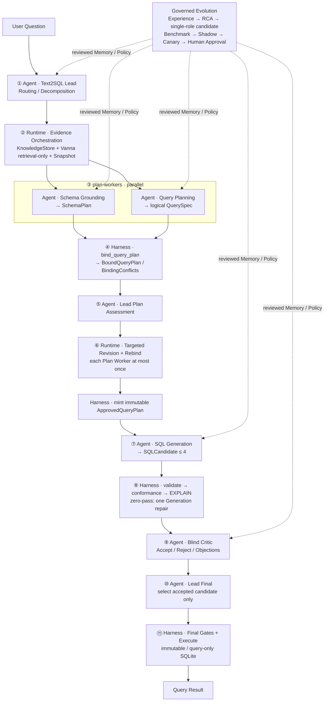

# EvoSQL

> Plan-first、可审计、可恢复的 Multi-Agent Text2SQL 系统。模型负责理解与提出候选，确定性 Harness 负责绑定、验真、限权和决定是否执行。

EvoSQL 把“一次 Prompt 直接生成 SQL”拆成五个职责隔离的 Agent 和一个不可演化的确定性 Harness：Schema Grounding 负责物理世界，Query Planning 负责逻辑语义，SQL Generation 只翻译已经冻结的计划，Blind Critic 独立质疑候选，Lead 只做路由、审批与选择。失败经验不会在线改 Prompt，而是经过离线评测、Shadow、Canary 和人工批准后受控进入稳定 Memory / Policy。

当前仓库定位为工程原型，不宣称已经完成生产部署。历史 EvoAgent PR Review 子系统仍以兼容模式保留；Python 包名 `evoagent` 与 `EVOAGENT_*` 环境变量暂不改名。

## 系统架构



生产主链协议为 `plan-first-text2sql-v3`，固定 11 个可恢复 Runtime Node。真正的并发只发生在第 3 个 `plan-workers` 节点内部：Schema Grounding 与 Query Planning 由线程池并行执行。Agent Role、Runtime Node 和 Codex `SKILL.md` 是三个不同概念；这里的五个名称是运行时角色与可演化 Policy 槽位，不是五个独立服务。

## Agent 职责、输入与工具

| 执行主体 | 核心输入 | 结构化输出 | 当前推理回合工具 |
|---|---|---|---|
| `text2sql-lead` | 原始问题、受限会话上下文、Worker / Critic 结果 | Route、Delegation、Plan Approval、Final Candidate Index | 路由阶段可使用受控事实工具；审批与最终选择为零工具 |
| `schema-grounding` | 固定 Schema Snapshot、ACL 可见的 stable Evidence、SchemaLinkPack | `SchemaPlan`：表、列、值绑定、Join、结果粒度 | Evidence Orchestration 预取后，本轮零工具 |
| `query-planning` | 用户问题、经过过滤的业务术语 | 不含物理表列与 SQL 的 `QuerySpec` | 零工具，最大 Tool ACL 也是空集 |
| `sql-generation` | Harness 铸造的不可变 `ApprovedQueryPlan` | 最多 4 个 `SQLCandidate` | 零工具，不能检索或执行 |
| `text2sql-critic` | ApprovedQueryPlan、通过门禁且去来源化的候选、对应 Gate 结果 | 每个候选恰好一个 Accept / Reject 决定 | 零工具，不能新增或修改 SQL |
| `text2sql-harness`（非 Agent） | 两类 Plan、候选 SQL、固定版本 Pin | Bound / Approved Plan、Gate 结果、查询结果 | `validate_sql`、`explain_sql`、最终 `execute_sql` |

角色最大权限与阶段权限取交集。`text2sql-lead` 和 `schema-grounding` 的最大 ACL 只包含事实查询能力；Planning、Generation、Critic 的最大 ACL 为空；只有 Harness 拥有 `execute_sql`，且只会在第 11 节点的最终门禁通过后调用。

## 为什么采用 Plan-first

单 Agent 同时做 Schema Linking、业务口径、SQL 生成和自我验收，常见问题包括：

- 引用不存在或语义相近但错误的表列；
- 把“案例数”算成 Join 后的明细行数；
- 未经审核地猜测 Join，产生 fanout 或笛卡尔积；
- SQL 语法正确，但投影、去重、排序、NULL 或结果粒度不符合问题；
- 模型既生成又批准自己的候选；
- Prompt 中的“请只读”被误当成数据库权限边界。

EvoSQL 先让两个独立 Worker 产出逻辑计划和物理计划，再由无模型 Binder 做完整、唯一绑定。SQL Generation 看不到原问题和检索材料，只能从 ApprovedQueryPlan 翻译 SQL，因此计划偏移可以在执行前被机器检查。

## RAG 与 Schema Linking

```text
MySQL Dump
  → Database Snapshot / Join Candidates
  → KnowledgeStore: stable / candidate / quarantined / revoked
  → lexical + exact value + approved graph retrieval
  → optional Vanna / Chroma semantic recall
  → stable + snapshot + ACL re-authorization
  → SchemaLinkPack/v2（候选，不是 SchemaPlan）
  → Schema Grounding
  → SchemaPlan
```

Vanna 在本项目中是纯检索器：`ask`、`generate_sql`、`submit_prompt` 和 `run_sql` 被显式封锁，也没有数据库连接。向量库只返回候选 `evidence_id`；每次命中都必须回到 KnowledgeStore 重新检查 stable 状态、数据库快照和调用者 ACL。

Query Planning 只接收白名单化的 `business_glossary` 字段。DDL、物理标识符、实库值、关系和 Question-SQL 示例都会被过滤；SQL Few-shot 只属于 SQL Generation，字段 / 值别名只属于 Schema Grounding。

## 确定性安全边界

模型一致同意也不等于可以执行。当前 Harness 会：

1. 对 QuerySpec 与 SchemaPlan 做严格类型、形状、唯一绑定和 fingerprint 校验；
2. 将模型给出的 Evidence ID 回源到当前 snapshot，并重新执行 Principal ACL 授权；
3. 要求 stable Join 来自本轮授权证据；`user_explicit` Join 必须由原始问题的精确 qualified-column 等式解析，不能由 Lead 改写或模型声明授权；
4. 对 `eq` / `in` 值检查只读实库成员关系；范围和 LIKE 检查类型、映射与可信表面来源；
5. 用 SQLGlot 拒绝 DDL、DML、多语句、注释逃逸、未知表列、`SELECT *` 和未建模查询形状；
6. 对投影顺序、聚合、`DISTINCT`、过滤、Join、排序、NULL 顺序、LIMIT、EXISTS 等做 ApprovedQueryPlan conformance；
7. 将候选与 Gate 结果按 Harness 生成的 `candidate_id` 对齐后再交给 Critic；
8. 在最终节点重新执行 AST 与 plan-conformance 检查；
9. 通过 `mode=ro&immutable=1`、`PRAGMA query_only=ON`、wall-clock timeout 和最大行数限制执行 SQLite。

追问中的 Lead `standalone_question` 只是推理输入，不是事实来源。新值必须来自本轮原始用户问题，或来自同一 user / session 下、最终 Gate 已接受的父 QueryRun 的结构化 QuerySpec；显式 Join 同理继承自可信父 SchemaPlan。FOLLOW_UP 缺少完整认证父快照时会停止，不能继续使用 Lead 改写生成 SQL，也不会静默绑定“最近一轮”。RESULT_QA 只支持明确要求重显上一轮结果的 replay：返回文案由 Harness 根据认证后的列与行确定性生成，不接受 Lead 自由编写的数字或事实；比较、过滤、排序或计算仍需发起新查询。自然语言表面匹配只能证明文本出现，不能形式化证明所有语义，因此新查询的最终语义仍由 Lead 与 Blind Critic 共同审核。

## 持久化 Checkpoint

每个节点成功后，系统把增量 State 与累计 Execution Ledger 写入 SQLite Checkpoint Store。恢复时只接受从第一个节点开始的连续已完成前缀，并继续第一个未完成节点。

Checkpoint 身份同时绑定：

- 原始问题、冻结会话上下文、user / session / tenant 与 effective principals；
- Database、Wiki、Vanna、Memory、Policy 五项版本 Pin；
- LLM provider、model、temperature 与 Token / 时间 / 步骤预算；
- stable / candidate lane；
- `plan-first-text2sql-v3`、完整 11 节点图、`BUILD_VERSION=text2sql-agentic-build-v3` 和 `GATE_IMPLEMENTATION_VERSION=text2sql-harness-gates-v2`。

Store 使用 Lease 避免同任务并发执行，使用 canonical JSON 与 SHA-256 检测状态篡改。协议、节点、Gate 实现或任一 Pin 漂移时，旧 Checkpoint 会 fail closed；完成任务在身份完全一致时可直接返回持久化结果。

## Memory 自进化

“自进化”不是让 Agent 在线改自己的 Prompt。当前闭环是：

```text
Query Result / Execution Trace / User Feedback / Evaluation Failure
  → candidate Experience Memory
  → deterministic Root-cause Attribution
  → responsible Agent role
  → single-role Policy or Memory candidate
  → train diagnostics
  → validation + sealed holdout
  → Shadow comparison
  → Canary with stable fallback
  → Human approval
  → stable role Policy / Memory
  → rollback when needed
```

失败类型会被归因到职责槽位，例如 Schema Linking → `schema-grounding`，计数 / 粒度 → `query-planning`，SQL 翻译 / conformance → `sql-generation`，错误接受候选 → `text2sql-critic`，路由 / 拆解 / 最终选择 → `text2sql-lead`。一次候选只能修改一个角色的白名单字段；拓扑、Binder、SQL Gate、数据库权限、评测集、审批状态和 Harness 永远不参与自修改。

晋升门禁不信任评测报告自带的聚合数字：它先校验 baseline / candidate 的匿名逐题 outcome 是否完整、唯一、类型合法且字段语义一致，再自行重算 EX、安全率、可执行率、AST 解析率、framework error、P95 延迟和 SQL Skeleton 分桶；任一声明值不一致、candidate 某个 split 的可执行率 / AST 解析率为零，或 sealed holdout 出现单题回退都会 fail closed。问题文本、Gold SQL 与逐题结果不会写入演化库。

## 当前可核验证据

以下数字来自仓库内固定工件，日期为 2026-09-04：

| 维度 | 当前结果 | 证据 |
|---|---:|---|
| 数据库快照 | 20 张表、562 行 | `artifacts/text2sql/schema/database_snapshot.json` |
| 稳定知识 | 395 条：293 Schema + 102 Value | `artifacts/text2sql/knowledge/manifest.json` |
| 候选知识 | 101 条：97 Relationship + 4 Business Glossary | 同上，审核前不进入 stable |
| Vanna 索引 | 395 项：20 DDL + 375 Documentation + 0 SQL | `artifacts/text2sql/vanna/stable-v2-2b44cc2f83/manifest.json` |
| 评测集 | 240 题；144 train / 48 validation / 48 sealed holdout | `evaluation/datasets/text2sql_v1/manifest.json` |
| 数据审核 | 240 / 240 人工复核，签名证书验证通过 | `evaluation/datasets/text2sql_v1/review_certificate.json` |
| 自动化测试 | 247 passed | 当前仓库全量 `pytest` |

仓库保留的 93.75% Execution Accuracy 是重构前 8 节点版本在 `qwen3.7-flash` 上的历史全量 baseline，只能用于回溯，不能冒充当前 v3 五 Agent 架构的成绩。v3 付费模型全量 benchmark 尚未运行。

## 快速体验

要求 Python 3.11、SQLite 3，以及一个 OpenAI Chat Completions 兼容模型端点。Vanna / Chroma 为可选依赖。

```bash
git clone https://github.com/miokiko/EvoSQL.git
cd EvoSQL

python3.11 -m venv .venv
source .venv/bin/activate
python -m pip install -r requirements.txt
cp .env.example .env
```

`.env` 已被 Git 忽略。不要提交 API Key、审核签名密钥或生产数据库凭据。

重建本地工件：

```bash
python scripts/generate_text2sql_schema.py
python scripts/build_text2sql_sqlite.py --replace
python scripts/build_text2sql_knowledge.py
python scripts/build_text2sql_vanna.py
python scripts/bootstrap_text2sql_evolution.py
```

配置 `.env`，例如：

```dotenv
EVOAGENT_LLM_PROVIDER=custom
EVOAGENT_LLM_BASE_URL=https://your-provider.example/v1
EVOAGENT_LLM_API_KEY=your-api-key
EVOAGENT_LLM_MODEL=your-model
```

运行单题：

```bash
python scripts/run_text2sql.py \
  "强烈岩爆案例有多少个" \
  --task-id demo-rockburst-001
```

使用相同问题与 `task-id` 重试可以从 Checkpoint 续跑；问题、身份、版本或预算变化时会拒绝复用旧状态。

无需 API 成本验证 11 节点协议与真实只读执行：

```bash
python -m pytest -q \
  tests/test_text2sql_phase2.py::Text2SQLSafetyTests::test_plan_first_protocol_runs_all_eleven_nodes_before_harness_execution
```

启动 Web 控制台：

```bash
python -m evoagent
```

浏览器访问 `http://127.0.0.1:8080/`。对外暴露前必须启用认证、设置强管理员密码并配置随机 `EVOAGENT_AUTH_SECRET`。

## 目录结构

| 路径 | 作用 |
|---|---|
| `evoagent/text2sql/agentic.py` | 五 Agent、11 节点主链与阶段协议 |
| `evoagent/text2sql/contracts.py` | QuerySpec / SchemaPlan / Candidate 等严格领域契约 |
| `evoagent/text2sql/query_plan.py` | deterministic bind、ApprovedPlan 与 SQL conformance |
| `evoagent/runtime.py` | 通用 Runtime、预算与节点 Checkpoint 协议 |
| `evoagent/text2sql/checkpoint_store.py` | SQLite 状态、Lease、Hash 与结果缓存 |
| `evoagent/text2sql/knowledge_store.py` | 版本化知识、ACL、状态机与结构化检索 |
| `evoagent/text2sql/vanna_retriever.py` | Retrieval-only Vanna / Chroma 适配层 |
| `evoagent/text2sql/schema_linking.py` | 问题直连与 SchemaLinkPack |
| `evoagent/text2sql/sql_safety.py` | AST 白名单与只读执行器 |
| `evoagent/text2sql/memory_attribution.py` | 失败根因与角色责任归因 |
| `evoagent/text2sql/memory_release.py` | Memory benchmark、审批、激活与回滚 |
| `evoagent/text2sql/evolution.py` | Policy / Experience / 发布治理账本 |
| `evoagent/text2sql/evaluation.py` | Execution Accuracy、规范化与失败分类 |
| `web/` | EvoSQL Web 控制台 |

## 深入阅读

- [Text2SQL 设计与适配方案](Text2SQL自进化适配方案.md)
- [Multi-Agent 基线](docs/text2sql/PHASE2_AGENTIC_BASELINE.md)
- [Checkpoint 运行手册](docs/text2sql/CHECKPOINT_RUNBOOK.md)
- [Vanna 与会话 Memory](docs/text2sql/VANNA_MEMORY_RUNBOOK.md)
- [评测协议](docs/text2sql/PHASE3_EVALUATION.md)
- [受控自进化](docs/text2sql/PHASE4_SELF_EVOLUTION.md)
- [Shadow / Canary](docs/text2sql/PHASE5_SHADOW_RELEASE.md)

## 当前限制

- 97 条推断 Relationship 和 4 条 Business Glossary 仍为 candidate；未审核关系不会进入稳定检索。
- 当前 Vanna stable 索引没有人工批准的 Question-SQL 样例。
- `QueryPlan/v1` 保守拒绝复合 Join、自连接、CTE、集合运算、通用子查询、OR、HAVING，以及尚无 cardinality / uniqueness 证明的明细 `rows + JOIN`；聚合、分组与存在性查询仍可使用受证据约束的 Join。
- 中文自然语言值的表面来源检查不是完整语义证明；系统依赖双计划、Lead 审批和 Blind Critic 共同降低误解风险。
- 本地 SQLite 是当前执行后端；远程数据库事务、资源隔离和生产压测尚待补充。
- 当前没有 v3 架构的付费模型全量 benchmark，也没有已经带来净提升的线上 Memory / Policy 发布案例。

## 数据与开源说明

仓库中的数据库 dump、Wiki 示例和评测工件用于本地研究与演示。公开发布前应确认原始数据、第三方内容和模型输出的授权范围。仓库当前未附带开源许可证；公开可见不等于自动授予再分发或商用许可。
